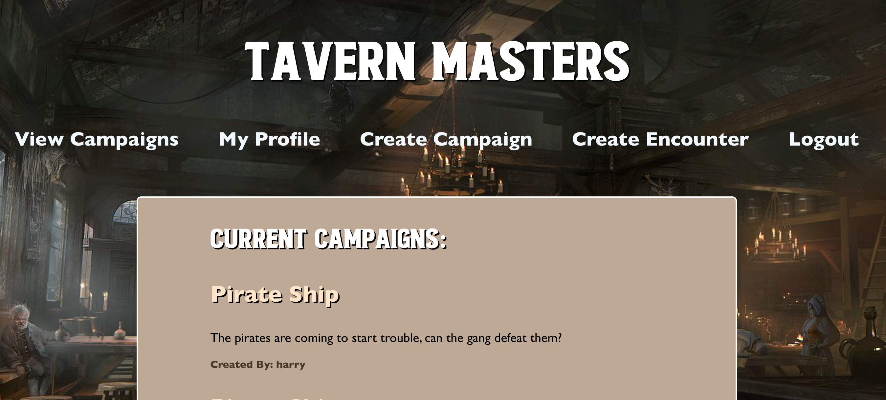

# Tavern Masters

 ## Description

This app is designed to help dungeon masters create campaigns.  When a user is logged in, they can save campaigns and encounters that may occur on their journey.

## Installation
  To install required dependecies, use: 
  `npm install` 

  ## Usage
  To run the app locally, open two command lines (one for client and one for server) and enter: `npm start`.  
  You can checkout the site below:  

<a href="https://tavern-masters.herokuapp.com/">Here is the live site.</a>

  
  ## Collaborators
  * Erik Rockenmeyer
  * Sarah Cylkowski
  * Thomas Ruppeniner
  * Alexander Lu
  * Grace Marcoux

 ## Built With
 This application is built with:  
 * React
 * GraphQL
 * Node.js
 * Express.js
 * MongoDB
 * Mongoose 

  ## Questions
  If you have any questions, please reach out on <a href="https://github.com/sacylkowski/">GitHub</a> or you can <a href="mailto:sacylkowski@gmail.com">E-mail me</a>.
